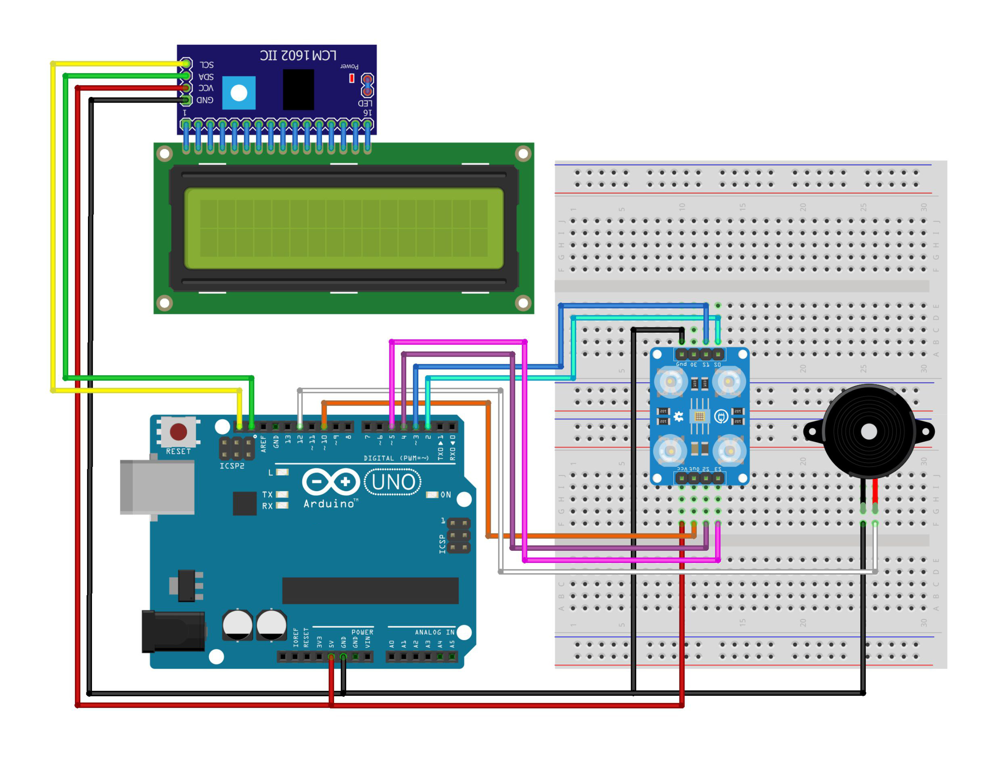

# Fruit Ripe Sorting Machine Based on Color Using Arduino

This project demonstrates a fruit sorting machine that identifies and sorts fruits based on their ripeness by detecting their color. The system uses an Arduino Uno, a TCS3200 color sensor, and a servo motor to categorize fruits into different bins depending on their color, which indicates their ripeness.

## Components Used (Tools & Materials)

- **Arduino IDE or Text Editor** (e.g., Visual Studio Code);
- **Library: LiquidCrystal_I2C**;
- **Arduino Uno** (or compatible board) - 1 Unit;
- **TCS3200 Color Sensor** - 1 Unit; (Sensor Warna)
- **\*LCD 16x2** - 1 Unit;
- **I2C** - 1 Unit;
- **Project Board / Breadboard** - 1 Unit (optional);
- **Jumper Wires**.

## Schematic

The schematic diagram outlines the connections between the color sensor and the Arduino board. This is essential for wiring the microcontroller to the necessary components.

## Circuit Diagram

- **Information**:

  - 5V – VCC I2C, VCC Sensor Warna
  - GND – GND I2C, GND Sensor Warna, GND Buzzer
  - D2 – S0 Sensor Warna
  - D3 – S1 Sensor Warna
  - D4 – S2 Sensor Warna
  - D5 – S3 Sensor Warna
  - D10 – Pin Out Sensor Warna
  - D12 – pin Buzzer
  - SDA – SDA I2C
  - SCL – SCL I2C
  - Pin LCD – Pin I2C

## Work steps

- Prepare the tools and materials to be used.
- Carry out the wiring process using Figure schematic of the above circuit.
- Open the Arduino IDE software that has been installed on laptop/computer.
- Download all the libraries above and insert the library by opening the Arduino IDE, selecting Sketch > Include Library -> Add.Zip Library.
- Type the sketch program on the Arduino IDE page.
- Enter the I2C LCD address in the sketch program.
- Carry out the program uploading process.

## Work Steps

1. Prepare all components and tools.
2. Assemble the circuit following the schematic diagram.
3. Open the Arduino IDE or your preferred text editor.
4. Upload the provided code to the Arduino Uno.

## How It Works

- The TCS3200 color sensor reads the color of the fruit as it passes through the sorting mechanism.
- The Arduino processes the color data to determine the fruit's ripeness based on predefined color thresholds.
- The servo motor, controlled by the Arduino, moves the fruit to the appropriate bin depending on its ripeness level.

## Code Explanation

- The color sensor is configured to detect RGB values of the fruit.
- The code processes these values and maps them to specific ripeness categories.
- The `Servo` library is used to control the servo motor, which directs the fruit to the correct bin based on its ripeness.

## Installation

1. Connect all components as per the circuit diagram.
2. Upload the code to your Arduino Uno using the Arduino IDE.
3. Calibrate the system with different fruits to ensure accurate sorting.

## Usage

- Place a fruit on the sorting mechanism.
- The color sensor detects the fruit's color, and the Arduino determines its ripeness.
- The servo motor moves the fruit to the corresponding bin based on its ripeness.

## Conclusion

This automated fruit sorting machine efficiently categorizes fruits based on ripeness, which is determined by their color. This project is ideal for use in agricultural applications to streamline the sorting process and improve accuracy.

Fruit will be sorted based on fruit color indicates the ripeness of the fruit, if the color of the fruit is there in the specified mature color range then the LCD will display ripe results indicating fruit it is ripe, otherwise if the color of the fruit is on the outside range is mature then the LCD will display a warning that the fruit is not yet ripe.

#### @Copyright 2024 | Fruit-Ripe-Sorting-Machine-BasedOn-Color
